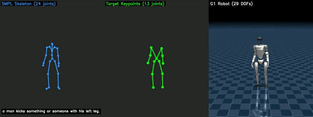
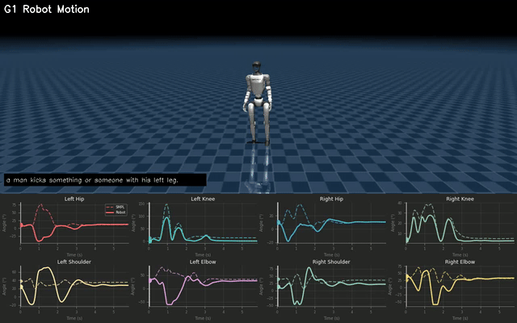

# MotionRetargetVisualization

Human motion capture to humanoid robot motion retargeting with smooth, kinematically feasible trajectories.

Built on Levenberg-Marquardt optimization, this tool ensures natural motion transitions while respecting joint limits and maintaining temporal smoothness.

---

## Table of Contents

- [Installation](#installation)
- [Data Preparation](#data-preparation)
- [Motion Retargeting Pipeline](#motion-retargeting-pipeline)
- [Joint Mapping Mechanism](#joint-mapping-mechanism)
- [Usage](#usage)
- [Visualization](#visualization)
- [Troubleshooting](#troubleshooting)

> 📖 **Deep Dive**: For a comprehensive technical explanation of the mapping mechanism with mathematical foundations, see [**doc/mapping_mechanism.md**](doc/mapping_mechanism.md).

---

## Installation

### Create Python Environment

```bash
conda create -n retarget python=3.8
conda activate retarget
pip install -r requirements.txt

# Additional dependencies for visualization
pip install pyrender trimesh matplotlib
```

---

## Data Preparation

### 1. AMASS Dataset

Download [AMASS Dataset](https://amass.is.tue.mpg.de/index.html) with `SMPL+H G` format.

```
MotionRetargetVisualization/
└── data/
    └── AMASS/
        └── AMASS_Complete/
            ├── ACCAD.tar.bz2
            ├── BMLhandball.tar.bz2
            ├── CMU.tar.bz2
            └── ...
```

Extract all archives:

```bash
cd MotionRetargetVisualization/data/AMASS/AMASS_Complete
for file in *.tar.bz2; do tar -xvjf "$file"; done
```

### 2. SMPL Model

Download [SMPL](https://smpl.is.tue.mpg.de/download.php) (pkl format).

```bash
cd MotionRetargetVisualization/data/smpl
unzip SMPL_python_v.1.1.0.zip
```

Create symlinks:

```bash
cd MotionRetargetVisualization/data/smpl
ln -s SMPL_python_v.1.1.0/smpl/models/basicmodel_neutral_lbs_10_207_0_v1.1.0.pkl SMPL_NEUTRAL.pkl
ln -s SMPL_python_v.1.1.0/smpl/models/basicmodel_m_lbs_10_207_0_v1.1.0.pkl SMPL_MALE.pkl
ln -s SMPL_python_v.1.1.0/smpl/models/basicmodel_f_lbs_10_207_0_v1.1.0.pkl SMPL_FEMALE.pkl
```

### 3. Occlusion Labels

Download [Occlusion Labels](https://drive.google.com/uc?id=1uzFkT2s_zVdnAohPWHOLFcyRDq372Fmc) and place in:

```
MotionRetargetVisualization/data/occlusion/amass_copycat_occlusion_v3.pkl
```

### 4. Text Labels

Extract `resources/texts.zip` to `data/texts/`:

```bash
cd MotionRetargetVisualization
unzip resources/texts.zip -d data/
```

### 5. Robot Model

Place your robot MJCF/URDF files in `resources/robots/<robot_name>/`.

Example for G1 robot:
```
MotionRetargetVisualization/resources/robots/g1/
├── g1_27dof.xml
├── g1_29dof.xml
└── meshes/
```

---

## Motion Retargeting Pipeline

The retargeting process transforms human motion capture data to robot joint trajectories through three stages:

```
┌─────────────────┐     ┌──────────────────┐     ┌─────────────────┐
│  SMPL Skeleton  │ --> │ Target Keypoints │ --> │   G1 Robot      │
│   (24 joints)   │     │   (13 joints)    │     │   (29 DOFs)     │
└─────────────────┘     └──────────────────┘     └─────────────────┘
     Stage 1                 Stage 2                  Stage 3
```

### Stage 1: SMPL Human Model
- Input: Motion capture data (AMASS format)
- Process: Forward kinematics through SMPL model
- Output: 24 joint 3D positions representing the human skeleton

### Stage 2: Keypoint Extraction
- Select 13 key joints from SMPL that correspond to robot joints
- Apply shape scaling to match robot proportions
- Output: Target 3D keypoint positions for IK

### Stage 3: Inverse Kinematics
- Use Levenberg-Marquardt optimization to find robot joint angles
- Minimize distance between robot links and target keypoints
- Apply joint limits and temporal smoothing
- Output: 29 DOF robot joint trajectories

---

## Joint Mapping Mechanism

### SMPL to Robot Joint Correspondence

The system maps 13 key SMPL joints to corresponding G1 robot links:

| Index | Target Joint | SMPL Joint | Robot Link |
|-------|--------------|------------|------------|
| 0 | Pelvis | Pelvis (0) | `pelvis` |
| 1 | L_Hip | L_Hip (1) | `left_hip_pitch_link` |
| 2 | L_Knee | L_Knee (4) | `left_knee_link` |
| 3 | L_Ankle | L_Ankle (7) | `left_ankle_roll_link` |
| 4 | R_Hip | R_Hip (2) | `right_hip_pitch_link` |
| 5 | R_Knee | R_Knee (5) | `right_knee_link` |
| 6 | R_Ankle | R_Ankle (8) | `right_ankle_roll_link` |
| 7 | L_Shoulder | L_Shoulder (16) | `left_shoulder_roll_link` |
| 8 | L_Elbow | L_Elbow (18) | `left_elbow_link` |
| 9 | L_Wrist | L_Wrist (20) | `left_wrist_yaw_link` |
| 10 | R_Shoulder | R_Shoulder (17) | `right_shoulder_roll_link` |
| 11 | R_Elbow | R_Elbow (19) | `right_elbow_link` |
| 12 | R_Wrist | R_Wrist (21) | `right_wrist_yaw_link` |

### Shape Scaling

Before retargeting, the SMPL model is scaled to match the robot's body proportions:

1. **Compute human link lengths** from SMPL joints
2. **Compute robot link lengths** from URDF/MJCF
3. **Optimize shape parameters** (beta) to minimize length differences
4. **Store scale factors** for runtime use

### IK Optimization

The inverse kinematics solver minimizes:

```
E = Σ wi ||pi_target - pi_robot||² + λ ||q - q_prev||²
```

Where:
- `pi_target`: Target keypoint position from SMPL
- `pi_robot`: Current robot link position
- `wi`: Per-joint weight (higher for hands/feet)
- `q`: Robot joint angles
- `λ`: Temporal smoothing weight

> 📖 **For detailed mathematical derivations** including Jacobian computation, Levenberg-Marquardt optimization, and rotation representations, see [**doc/mapping_mechanism.md**](doc/mapping_mechanism.md).

---

## Usage

### Step 1: Shape Fitting

Fit the SMPL model to match your robot's proportions.

```bash
cd MotionRetargetVisualization/scripts/g1
python fit_robot_shape_g1.py
```

Output: `data/g1/optimized_shape_scale_g1.pkl`

### Step 2: Motion Retargeting

Retarget human motions to your robot.

```bash
cd MotionRetargetVisualization/scripts/g1
python process_humanml3d_g1.py
```

**Options** (edit in script):
- `num_samples = 100` - Number of motions to process (set to `None` for all)

Output: `data/g1/humanml3d_train_retargeted_wholebody_<N>.pkl`

---

## Visualization

This project provides comprehensive visualization tools to understand every aspect of the motion retargeting process. Each visualization mode is designed to answer specific questions about the pipeline.

### Quick Start

```bash
cd MotionRetargetVisualization/scripts

# Generate side-by-side comparison (recommended for understanding the pipeline)
python mujoco_comparison_recorder.py --mode sidebyside --max_motions 10

# Generate ALL visualization types at once
python mujoco_comparison_recorder.py --mode all --max_motions 10
```

---

### Available Visualization Modes

#### 1. Side-by-Side Comparison (`sidebyside`)

**Question Answered:** *"What happens at each stage of the retargeting pipeline?"*

This mode displays three synchronized panels showing the complete transformation from human motion to robot motion:

```bash
python mujoco_comparison_recorder.py --mode sidebyside --max_motions 10
```



| Panel | Content | Description |
|-------|---------|-------------|
| **Panel 1** | SMPL Skeleton | Full 24-joint human skeleton from motion capture |
| **Panel 2** | Target Keypoints | 13 selected joints used as IK targets |
| **Panel 3** | G1 Robot | Final robot motion rendered in MuJoCo |

**What to look for:**
- How the 24-joint skeleton is simplified to 13 keypoints
- How well the robot matches the target keypoint positions
- Timing synchronization across all three stages

**Best for:** Understanding the complete pipeline flow, presentations, documentation.

---

#### 2. Overlay View (`overlay`)

**Question Answered:** *"How well does each stage align spatially?"*

All three stages are rendered on top of each other in a single view, using different colors to distinguish them:

```bash
python mujoco_comparison_recorder.py --mode overlay --max_motions 10
```


| Color | Element | Purpose |
|-------|---------|---------|
| **Orange** | SMPL skeleton lines | Original human pose |
| **Green circles** | Target keypoints | IK optimization targets |
| **Yellow lines** | Correspondence | Lines connecting targets to robot |
| **3D Model** | G1 Robot | Physical robot representation |

**What to look for:**
- Spatial alignment between skeleton, keypoints, and robot
- Areas where the robot deviates from target positions
- Overall pose fidelity

**Best for:** Verifying alignment accuracy, debugging pose mismatches.

---

#### 3. Joint Correspondence (`correspondence`)

**Question Answered:** *"Which human joints map to which robot links?"*

A color-coded visualization where each of the 13 joint mappings has a unique color, with lines connecting corresponding points:

```bash
python mujoco_comparison_recorder.py --mode correspondence --max_motions 10
```


| Color | Joint Mapping |
|-------|---------------|
| 🔴 Red | Pelvis → `pelvis` |
| 🟠 Orange | L_Hip → `left_hip_pitch_link` |
| 🟢 Green | L_Knee → `left_knee_link` |
| 🔵 Cyan | L_Ankle → `left_ankle_roll_link` |
| 🟡 Yellow | R_Hip → `right_hip_pitch_link` |
| 🟣 Purple | Shoulders, Elbows, Wrists |

**What to look for:**
- Line lengths indicate IK error (shorter = better)
- Which joints have the most deviation
- Symmetry between left and right sides

**Best for:** Understanding joint mapping, identifying problematic joints.

---

#### 4. IK Error Visualization (`error`)

**Question Answered:** *"How accurate is the retargeting? Where does it fail?"*

Real-time error measurement with color gradient showing retargeting quality:

```bash
python mujoco_comparison_recorder.py --mode error --max_motions 10
```


| Error Range | Color | Meaning |
|-------------|-------|---------|
| 0 - 3 cm | 🟢 Green | Excellent match |
| 3 - 6 cm | 🟡 Yellow | Acceptable deviation |
| 6 - 10 cm | 🟠 Orange | Noticeable error |
| > 10 cm | 🔴 Red | Significant mismatch |

**Features:**
- Circle size proportional to error magnitude
- Real-time statistics (mean, max error)
- Color gradient bar for reference

**What to look for:**
- Which body parts have consistent errors
- Whether errors are systematic or random
- Frames with sudden error spikes

**Best for:** Quality assessment, debugging IK failures, comparing retargeting methods.

---

#### 5. Multi-View (`multiview`)

**Question Answered:** *"What does the motion look like from all angles?"*

2x2 grid showing synchronized views from four camera angles:

```bash
python mujoco_comparison_recorder.py --mode multiview --max_motions 10
```


| View | Azimuth | Elevation | Best For |
|------|---------|-----------|----------|
| **Front** | 0° | -15° | Symmetry check |
| **Side** | 90° | -15° | Forward/backward motion |
| **Top** | 0° | 89° | Spatial coverage |
| **3/4** | 45° | -15° | Overall impression |

**What to look for:**
- Motion consistency across all views
- Depth perception issues visible from side view
- Foot placement from top view
- Natural appearance from 3/4 view

**Best for:** Comprehensive motion review, detecting artifacts hidden in single view.

---

#### 6. Trajectory Trails (`trajectory`)

**Question Answered:** *"How do the limbs move through space over time?"*

Motion paths showing the movement history of key joints with fading trails:

```bash
python mujoco_comparison_recorder.py --mode trajectory --max_motions 10
```


| Joint | Color | Trail Meaning |
|-------|-------|---------------|
| **Pelvis** | ⚪ White | Center of mass trajectory |
| **L_Hand** | 🔵 Blue | Left arm movement |
| **R_Hand** | 🔴 Red | Right arm movement |
| **L_Foot** | 🩵 Cyan | Left leg stepping |
| **R_Foot** | 🟡 Yellow | Right leg stepping |

**Features:**
- 30-frame trail history
- Alpha fade for temporal context
- Skeleton overlay for current pose

**What to look for:**
- Smooth vs jerky motion paths
- Symmetry in arm/leg movements
- Walking gait patterns
- Hand gesture trajectories

**Best for:** Motion dynamics analysis, gait study, gesture understanding.

---

#### 7. Joint Angle Comparison (`angles`)

**Question Answered:** *"How do the actual joint angles compare between human and robot?"*

Split-screen with robot animation and synchronized joint angle plots:

```bash
python mujoco_comparison_recorder.py --mode angles --max_motions 10
# Or standalone:
python joint_angle_plotter.py --max_motions 10
```



| Plot Line | Style | Source |
|-----------|-------|--------|
| **Solid** | ─── | Robot joint angles |
| **Dashed** | --- | SMPL joint angles |
| **Vertical** | │ | Current frame marker |

**Tracked Joints (8 total):**
- Left/Right Hip pitch
- Left/Right Knee
- Left/Right Shoulder pitch
- Left/Right Elbow

**What to look for:**
- Phase alignment between human and robot
- Amplitude differences (robot may have limited range)
- Lag or lead in joint response
- Systematic offset patterns

**Best for:** Quantitative analysis, joint limit debugging, motion timing validation.

---

#### 8. Generate All Modes (`all`)

**Question Answered:** *"I need everything for a complete analysis!"*

Generate all 7 visualization types for each motion in one command:

```bash
python mujoco_comparison_recorder.py --mode all --max_motions 10
```

**Output Structure:**
```
output/videos_all/
├── overlay/           # 🔹 Spatial alignment check
├── sidebyside/        # 🔹 Pipeline understanding  
├── correspondence/    # 🔹 Joint mapping visualization
├── error/             # 🔹 Quality assessment
├── multiview/         # 🔹 Multi-angle inspection
├── trajectory/        # 🔹 Motion dynamics
└── angles/            # 🔹 Quantitative comparison
```

**Estimated Time:** ~12 seconds per motion (all 7 modes)

**Best for:** Complete documentation, comprehensive analysis, presentations, research papers.

### Command-Line Options

| Option | Description | Default |
|--------|-------------|---------|
| `--mode` | Visualization mode (`sidebyside`, `overlay`, `correspondence`, `error`, `multiview`, `trajectory`, `all`) | `sidebyside` |
| `--max_motions` | Number of videos to generate | `5` |
| `--output_dir` | Custom output directory | `output/videos_<mode>` |

### Interactive Viewer (requires display)

For local development with a display:

```bash
python mujoco_visualization.py
```

---

## Output Structure

```
MotionRetargetVisualization/
├── data/
│   └── g1/
│       ├── optimized_shape_scale_g1.pkl      # Shape fitting result
│       └── humanml3d_train_retargeted_*.pkl  # Retargeted motions
└── output/
    ├── videos_comparison_sidebyside/         # Side-by-side comparison
    ├── videos_comparison_overlay/            # Overlay comparison
    ├── videos_correspondence/                # Joint mapping visualization
    ├── videos_error/                         # IK error visualization
    ├── videos_multiview/                     # Multi-angle view
    ├── videos_trajectory/                    # Motion trails
    └── videos_angles/                        # Joint angle plots
```

---

## Data Format

The retargeted motion data (`humanml3d_train_retargeted_*.pkl`) contains:

| Field | Shape | Description |
|-------|-------|-------------|
| `root_trans_offset` | (T, 3) | Robot root position in world frame |
| `root_rot` | (T, 4) | Root orientation quaternion (XYZW) |
| `dof` | (T, 29) | Robot joint angles in radians |
| `global_translation` | (T, 30, 3) | Robot link positions |
| `mocap_global_translation` | (T, 24, 3) | Original SMPL joint positions |
| `target_keypoints` | (T, 13, 3) | IK target keypoint positions |
| `smpl_pose_aa` | (T, 72) | SMPL axis-angle pose parameters |
| `smpl_betas` | (10,) | SMPL shape parameters |
| `captions` | list | Text descriptions of the motion |

---

## Troubleshooting

### GLFW Error on headless server

```
GLFWError: X11: The DISPLAY environment variable is missing
```

**Solution:** Use the video recorder scripts instead of interactive viewer:
```bash
python mujoco_comparison_recorder.py --mode sidebyside
```

### SMPL model not found

```
Path ../../data/smpl/SMPL_NEUTRAL.pkl does not exist!
```

**Solution:** Create symlinks as shown in Data Preparation section.

### EGL/OpenGL issues

```
AttributeError: module 'OpenGL.EGL' has no attribute 'EGLDeviceEXT'
```

**Solution:** Install compatible PyOpenGL version:
```bash
pip install PyOpenGL==3.1.6
```

### PyRender not rendering

**Solution:** Ensure EGL is properly set up:
```bash
pip install pyrender trimesh
export PYOPENGL_PLATFORM=egl
```

---

## Citation

If you use this tool in your research, please cite:

```bibtex
@software{motion_retarget_viz,
  title = {MotionRetargetVisualization},
  year = {2024},
  url = {https://github.com/your-repo/MotionRetargetVisualization}
}
```

---

## License

See [LICENSE](LICENSE) for details.
